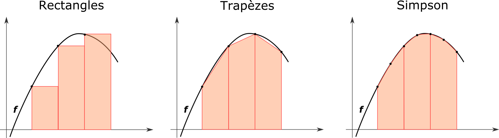
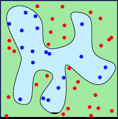

---
jupyter:
  jupytext:
    notebook_metadata_filter: all
    text_representation:
      extension: .md
      format_name: markdown
      format_version: '1.3'
      jupytext_version: 1.11.5
  kernelspec:
    display_name: Python 3
    language: python
    name: python3
  language_info:
    codemirror_mode:
      name: ipython
      version: 3
    file_extension: .py
    mimetype: text/x-python
    name: python
    nbconvert_exporter: python
    pygments_lexer: ipython3
    version: 3.9.7
  metadata:
    execution:
      allow_errors: true
  rise:
    enable_chalkboard: true
    height: 90%
    scroll: true
    width: 90%
---

Merci de **ne pas modifier** le nom de ce notebook (même pour y inclure son nom).

Quelques conseils:
- pour exécutez une cellule, cliquez sur le bouton *Exécuter* ci-dessus ou tapez **Shift+Enter**
- si l'exécution d'une cellule prend trop de temps, sélectionner dans le menu ci-dessus *Noyau/Interrompre*
- en cas de très gros plantage *Noyau/Redémarrer*
- **sauvegardez régulièrement vos réponses** en cliquant sur l'icone disquette ci-dessus à gauche, ou *Fichier/Créer une nouvelle sauvegarde*

----------------------------------------------------------------------------


# Séance 4 : intégrales avancées

<!-- #region slideshow={"slide_type": "slide"} -->
## Calculs d'intégrales

La fonction $f$ à intégrer est échantillonnée en un nombre restreint de
points $\rightarrow$ plusieurs outils sont à notre disposition, par
exemple :

-   interpolation polynomiale entre points également espacés, puis
    intégration $\rightarrow$ **formules de Newton - Cotes** (*simple et
    robuste - standard pour une fonction facile à évaluer*)

-   "optimisation" des points où est évaluée la fonction $\rightarrow$
    **quadrature Gaussienne** (*plus de liberté - plus difficile
    d'estimer l'erreur commise*)

-   échantillonage aléatoire de la fonction $\rightarrow$ **calcul
    "Monte-Carlo"** (*particulièrement utile à N-dimensions*)

**Cette séance : Formules de Gauss-legendre et méthode Monte-Carlo.**
<!-- #endregion -->

<!-- #region slideshow={"slide_type": "slide"} -->
**Vu en L1:** $f(x)$ est échantillonnée entre $a$ et $b$. On souhaite
estimer $\int_a^b f(x){\rm d}x$.

-   ordre 0 : somme de Riemann

-   ordre 1 : méthode des trapèzes

-   ordre 2 : méthode de Simpson



<!-- #endregion -->

<!-- #region slideshow={"slide_type": "slide"} -->
## Formules de Newton - Cotes

**Vu en L1:** $f(x)$ est échantillonnée entre $a$ et $b$. On souhaite
estimer $\int_a^b f(x){\rm d}x$.

-   ordre 0 : somme de Riemann avec $n$ points (valeurs à gauche),
    $h=(b-a)/n$ et $x_i=a+(i+1)\times h$ :

    $$\int_a^b f(x){\rm d}x = \sum_{i=0}^{n-1} hf(x_i)  + O\left(\frac{(b-a)^2f'}{n}\right)\nonumber$$

-   ordre 1 : méthode des trapèzes avec $n+1$ points, avec $f_i=f(x_i)$:

    $$\int_a^b f(x){\rm d}x = h\times\left(\frac{f_0}{2} + f_1 + f_2 + \ldots + f_{n-1} + \frac{f_{n}}{2}\right) + O\left(\frac{(b-a)^3f''}{n^2}\right)$$

-   ordre 2 : méthode de Simpson avec un nombre impair de points :

    $$\int_a^b f(x){\rm d}x  = h\times\left(\frac{1}{3}f_0 + \frac{4}{3}f_1 + \frac{2}{3}f_2  + \ldots  + \frac{4}{3}f_{n-1} + \frac{1}{3}f_{n}\right) + O\left(\frac{(b-a)^5f^{(4)}}{n^4}\right)$$
<!-- #endregion -->

<!-- #region slideshow={"slide_type": "slide"} -->
## Méthode des rectangles

La fonction ci-dessous renvoie l'intégrale de
$\int_0^1 3x^2{\rm d}x = 1$ par la méthode des rectangles (à gauche),
ainsi que l'écart relatif à la valeur exacte:
<!-- #endregion -->

```python codeCellConfig={"lineNumbers": true} slideshow={"slide_type": "-"} tags=["raises-exception"]
import numpy as np

def rect(a,b,N):
    x=np.linspace(a,b,N)
    h=x[1]-x[0]
    y=3*x*x
    return np.sum(y[:-1])*h
a=0
b=1
I=1
print(rect(a,b,101),abs(rect(a,b,101)-I)/I)
print(rect(a,b,1001),abs(rect(a,b,1001)-I)/I)
```

Lorsqu'on multiplie le nombre de rectangles par 10, $h$ et l'écart sont
divisés par 10 : la méthode des rectangles a une convergence en $1/N$.

<!-- #region slideshow={"slide_type": "slide"} -->
## Méthode des trapèzes

La fonction ci-dessous renvoie l'intégrale de
$\int_0^1 3x^2{\rm d}x = 1$ par la méthode des trapèzes ainsi que
l'écart relatif à la valeur exacte:
<!-- #endregion -->

```python codeCellConfig={"lineNumbers": true} slideshow={"slide_type": "-"} tags=["raises-exception"]
def trapz(a,b,N):
    x=np.linspace(a,b,N)
    h=x[1]-x[0]
    y=3*x*x
    I=np.sum(y)-0.5*(y[0]+y[-1])
    return I*h
a, b, I = 0, 1, 1
print(trapz(a,b,101),abs(trapz(a,b,101)-I)/I)
print(trapz(a,b,1001),abs(trapz(a,b,1001)-I)/I)
```

Lorsqu'on multiplie le nombre de trapèzes par 10, l'écart est divisé par
100 : la méthode des trapèzes a une convergence en $1/N^2$.

**Rappel :** la méthode des trapèzes est implémentée dans python via
`scipy.integrate.trapz`.

<!-- #region slideshow={"slide_type": "slide"} -->
## Méthode de Gauss-Legendre

L'idée est de généraliser les méthodes de Newton Cotes d'ordre 0, 1, 2
\... mais pour des points espacés de manière non régulière dans
l'intervalle d'intégration. De manière générale l'intégrale est calculée
comme :

$$\int_a^b f(x){\rm d}x \approx \frac{b-a}{2} \sum_{i=1}^{n} w_if(x'_i)$$

Les **poids $w_i$** et les **points $x'_i$** sont choisis de manière à
ce que la méthode donne la **valeur exacte** pour les **polynômes**
d'ordre $0,1,..,2n-1$.
<!-- #endregion -->

<!-- #region slideshow={"slide_type": "slide"} -->
**Exemple quadrature de Gauss à deux points : $n=2$**

On cherche $w_1$, $x'_1$, $w_2$ et $x'_2$ tels que :

$$I = \int_{-1}^1 f(x){\rm d}x \approx  w_1f(x'_1)+w_2f(x'_2) = \tilde{I}$$

Pour l'ensemble des polynômes de degré $k = 0, 1, 2, 3=2n-1$ avec :

$$\int_{-1}^1 x^k{\rm d}x =  w_1f(x'_1)+w_2f(x'_2)$$

-   pour le degré 0, $f(x) = 1$ et $\int_{-1}^1 {\rm d}x = 2 =  w_1+w_2$

-   pour le degré 1, $f(x) = x$ et
    $\int_{-1}^1 x{\rm d}x = 0 =  w_1x'_1+w_2x'_2$

-   pour le degré 2, $f(x) = x^2$ et
    $\int_{-1}^1 x^2{\rm d}x = \frac{2}{3} =  w_1{x'_1}^2+w_2{x'_2}^2$

-   pour le degré 3, $f(x) = x^3$ et
    $\int_{-1}^1 x^3{\rm d}x = 0 =  w_1{x'_1}^3+w_2{x'_2}^3$

On a 4 équations avec 4 inconnues. La solution est :

$$w_1 =w_2 =1,\quad  x'_1 = -\frac{\sqrt{3}}{3},\quad  x'_2 = \frac{\sqrt{3}}{3}, \quad \tilde{I} = f\left(-\frac{\sqrt{3}}{3} \right) + f\left(\frac{\sqrt{3}}{3} \right) = I$$
<!-- #endregion -->

<!-- #region slideshow={"slide_type": "slide"} -->
Ces poids et ces racines ne semblent pas sortir de nulle part.

Regardons les quatre premiers polynômes de Legendre $P_n(x)$ :

$$P_0(x) = 1, \quad P_1(x) = x, \quad P_2(x) = \frac{1}{2}(3x^2-1), \quad P_3(x) = \frac{1}{2}(5x^3-3x)$$
<!-- #endregion -->

```python codeCellConfig={"lineNumbers": true} slideshow={"slide_type": "-"} tags=["raises-exception"]
from scipy.special import legendre
import numpy as np
import matplotlib.pyplot as plt

x = np.linspace(-1, 1, 100)
for n in range(5):
    Pn = legendre(n)
    plt.plot(x, Pn(x), label="$P_"+str(n)+"(x)$")
plt.grid(); plt.legend()
plt.axhline(0, color="k", lw=2)
plt.show()
```

<!-- #region slideshow={"slide_type": "slide"} -->
Ces poids et ces racines ne semblent pas sortir de nulle part.

Regardons les quatre premiers polynômes de Legendre $P_n(x)$ :

$$P_0(x) = 1, \quad P_1(x) = x, \quad P_2(x) = \frac{1}{2}(3x^2-1), \quad P_3(x) = \frac{1}{2}(5x^3-3x)$$

Les valeurs de $x'_1$ et $x'_2$ trouvées dans le cas $n=2$ correspondent
aux zéros de $P_2(x)$.
<!-- #endregion -->

<!-- #region slideshow={"slide_type": "slide"} -->
**Généralisation $n>2$:** L'intégrale que l'on souhaite calculer est
exprimée sous forme :

$$\int_{-1}^1 f(x){\rm d}x \approx \sum_{i=1}^{n} w_if(x'_i)$$

On peut montrer que cette intégrale est exacte pour tous les polynômes
de degré $2n-1$ si:

-   $x'_i$ est la $i^{eme}$ racine du polynôme de Legendre $P_{n}$;

-   les poids sont donnés par
    $w_i = \dfrac{2}{(1-{x'_i}^2) P_{n}'^2(x'_i)}$.

On peut aussi montrer que :

$$\forall n > 1,\ \sum_{i=1}^{n} w_i = (b-a) = 2 \text{ ici}$$
<!-- #endregion -->

<!-- #region slideshow={"slide_type": "slide"} -->
**Généralisation $n>2$:**

La fonction `leggauss` du module de `numpy.polynomial.legendre` permet
d'obtenir les poids (array w) et les racines (array x) pour un $n$ donné
:
<!-- #endregion -->

```python codeCellConfig={"lineNumbers": true} slideshow={"slide_type": "-"} tags=["raises-exception"]
x, w = np.polynomial.legendre.leggauss(2)
print(x)
print(w)
```

<!-- #region slideshow={"slide_type": "slide"} -->
**Généralisation $n>2$:** Pour calculer une intégrale entre des bornes
quelconques, la méthode est la même avec :

$$\int_a^b f(x){\rm d}x \approx \frac{(b-a)}{2}\sum_{i=1}^{n} w_if(x''_i)$$

où les poids sont les mêmes que précédemment mais par contre les racines
sont :

$$x''_i= \frac{(b-a)}{2}{x'_i}+\frac{(a+b)}{2}$$
<!-- #endregion -->

<!-- #region slideshow={"slide_type": "slide"} -->
**Généralisation $n>2$:**

La fonction ci-dessous renvoie l'intégrale de
$\int_0^\pi \sin(x){\rm d}x = 2$ par la méthode de Gauss-Legendre avec
10 points ainsi que l'écart relatif à la valeur exacte:
<!-- #endregion -->

```python codeCellConfig={"lineNumbers": true} slideshow={"slide_type": "-"} tags=["raises-exception"]
def trapz(a,b,N):
    x=np.linspace(a,b,N)
    y=np.sin(x)
    return (x[1]-x[0])*np.sum(y)-(y[0]+y[-1])/2

def intg(a,b,n):
    x, w = np.polynomial.legendre.leggauss(n)
    f = np.sin(x*(b-a)/2 + (a+b)/2)*w
    return np.sum(f)*(b-a)/2   
     
a, b, n=0, np.pi, 10
print(intg(a,b,n), abs((intg(a,b,n)-2)/2))
print(trapz(a,b,n), abs((trapz(a,b,n)-2)/2))
```

Avec un nombre de points équivalents, l'intégration par cette méthode
est plus précise qu'avec les méthodes de Newton-Cotes.

<!-- #region slideshow={"slide_type": "slide"} -->
## Fonctions de `scipy.integrate`

Un outil général d'intégration des fonctions 1D existe dans le module
`scipy.integrate` : `quad` (pour quadrature). Il prend comme argument
une fonction et ses bornes puis renvoie l'intégrale et la précision
absolue sur cette intégrale.
<!-- #endregion -->

```python codeCellConfig={"lineNumbers": true} slideshow={"slide_type": "-"} tags=["raises-exception"]
from scipy.integrate import quad

a=0
b=np.pi
f=lambda x: np.sin(x)
print(quad(f,a,b))
```

<!-- #region slideshow={"slide_type": "slide"} -->
Un outil général d'intégration des fonctions 2D existe dans le module
`scipy.integrate` : `dblquad` (pour double quadrature). Voici sa
définition :
<!-- #endregion -->

```python codeCellConfig={"lineNumbers": true} slideshow={"slide_type": "-"} tags=["raises-exception"]
def dblquad(func, a, b, gfun, hfun):
    """
    Compute a double integral.
    Return the double (definite) integral of ``func(y, x)``
     from ``x = a..b`` and ``y = gfun(x)..hfun(x)``.
    """
    ...
```

Elle permet de calculer des intégrales du type :

$$\int_a^b \mathrm{d}x \left(\int_{g(x)}^{h(x)} \mathrm{d}y\ f(y,x)\right) = \int_a^b  \int_{g(x)}^{h(x)}\mathrm{d}x \mathrm{d}y\ f(y,x),$$

où les bornes du domaine suivant $y$ peuvent dépendre de $x$. Attention
le premier argument de $f$ doit être $y$, puis $x$.

<!-- #region slideshow={"slide_type": "slide"} -->
Exemple avec :

$$\int_0^\pi \mathrm{d}x \int_{0}^{2x} \mathrm{d}y \sin\left(xy\right)$$
<!-- #endregion -->

```python codeCellConfig={"lineNumbers": true} slideshow={"slide_type": "-"} tags=["raises-exception"]
from scipy.integrate import dblquad
import numpy as np

#bornes suivant x
ax, bx = 0, np.pi

#bornes suivant y
h = lambda x : 0
g = lambda x : 2*x

ff = lambda y, x: np.sin(x*y)
print(dblquad(ff, ax, bx, h, g))
```

<!-- #region slideshow={"slide_type": "slide"} -->
## Intégration par la méthode de Monte-Carlo

Il s'agit d'évaluer numériquement la valeur de l'intégrale d'une
fonction $f$ définie dans un espace ${\mathbb R}^d$

$$I=\int_\Omega f(\mathbf{x})d\mathbf{x}$$

La vitesse de convergence est un indicateur de l'efficacité de la
méthode utilisée pour évaluer l'intégrale.

-   Méthode des trapèzes: $n^{-2/d}$

-   Méthode de Simpson: $n^{-4/d}$

Pour ces méthodes la vitesse de convergence diminue quand $d$ augmente.
Ces algorithmes évaluent l'intégrande sur une grille régulière dans
$\mathbb{R}^d$.
<!-- #endregion -->

<!-- #region slideshow={"slide_type": "slide"} -->
**Méthode vue en L1 : calcul de l'aire d'une surface**

-   Il s'agit de trouver *manu militari* la valeur de la surface $S_L$
    d'un lac à l'intérieur d'un terrain de surface connue $S_T$.

-   On tire N boulets de canon sur le terrain d'une façon aléatoire et
    homogène et on compte le nombre de boulets M qui sont tombés dans le
    lac.

-   Pour un nombre N très grand on peut estimer la surface du lac comme:

    $$S_L=\frac{M}{N}S_T$$




Rappelez-vous, comment calculer $\pi$ par cette méthode?
<!-- #endregion -->

<!-- #region slideshow={"slide_type": "slide"} -->
**Nouvel algorithme : méthode de la moyenne.**

Dans la méthode Monte-Carlo, les $N$ points $\mathbf{x}_i$ sont répartis
aléatoirement dans le domaine d'intégration $\Omega$ : **$x_i$ est une
variable aléatoire et $\mathbf{x_1}\cdots\mathbf{x_N}\in \Omega$**

On définit une fonction densité de probabilité $p(\mathbf{x_i})$ qui
donne la probabilité que la variable aléatoire $\mathbf{x_i}$ prenne une
valeur comprise entre $\mathbf{x_i}$ et $\mathbf{x_i} +d\mathbf{x}$ de
sorte que $\int_\Omega p(\mathbf{x})d\mathbf{x} = 1$

Or la moyenne d'une fonction continue $f(\mathbf{x})$ où $\mathbf{x}$
est une variable aléatoire suivant la densité de probabilité
$p(\mathbf{x})$ est

$$\displaystyle{\left\langle f \right\rangle_\mathbf{x}  = \int_\Omega f(\mathbf{x}) p(\mathbf{x})d\mathbf{x} \approx \dfrac{\displaystyle \sum_{i=1}^N p(\mathbf{x_i}) f(\mathbf{x_i})}{\displaystyle \sum_{i=1}^N p(\mathbf{x_i})}}$$
<!-- #endregion -->

<!-- #region slideshow={"slide_type": "slide"} -->
Le volume du domaine d'intégration est :

$$V=\int_\Omega d\mathbf{x}$$

Une densité de probabilité uniforme correspond à une fonction
$p(\mathbf{x_i}) = 1/V$, alors :

$$\displaystyle{\left\langle f \right\rangle \approx \dfrac{ \sum_{i=1}^N p(\mathbf{x_i}) f(\mathbf{x_i})}{\sum_{i=1}^N p(\mathbf{x_i})}} = \frac{1}{N} \sum_{i=1}^N f(\mathbf{x_i})$$

Avec $p(\mathbf{x})$ une densité de probabilité uniforme, l'intégrale de
la fonction $f$ sur le domaine $\Omega$ peut alors être exprimée par:

$$I  = \int_\Omega  f(\mathbf{x}) d\mathbf{x} = V \times \left\langle f \right\rangle 
     \approx   \frac{V}{N} \sum_{i=1}^{N} f(\mathbf{x_i}) \xrightarrow[{N\to\infty}]{} I$$

L'erreur commise sur $I$ évolue donc en $1/\sqrt{N}$ d'après le théorème
central limite, **quelque soit la dimension $d$ du problème**.
<!-- #endregion -->

<!-- #region slideshow={"slide_type": "slide"} -->
On applique directement la formule. Exemple ci-dessous pour :

$$f(x)=x(1-x)\sin^2\left(200x(1-x)\right), \quad \int_0^1 f(x) dx \approx 0.080498$$
<!-- #endregion -->

```python codeCellConfig={"lineNumbers": true} slideshow={"slide_type": "-"} tags=["raises-exception"]
# charge les librairies
import matplotlib.pyplot as plt
import numpy as np
from scipy.integrate import quad

# fonction a integrer
def f(x):
    return x*(1-x)*np.sin((200*x*(1-x)))**2

# integrale
N = 1000
points = np.random.uniform(0,1,size=N)
I = np.sum(f(points)) / N
print("N =",N,": I =",I)
print("Scipy:", quad(f,0,1))

# graphique
xx  = np.linspace(0, 1, 1000)
fig = plt.figure(figsize=(6,4))
plt.plot(xx, f(xx))
plt.scatter(points,f(points),c="red")
plt.xlabel('$x$')
plt.ylabel('$f(x)$')
plt.title(f'N={N}, I={I:.4f}, $\epsilon \\approx$ {I/np.sqrt(N):.4f}')
plt.show()
```

<!-- #region slideshow={"slide_type": "slide"} -->
**Retour sur la méthode du jet de pierre vue en L1:** on rajoute une
dimension au problème et on calcule l'intégrale de la fonction $g(x,y)$
:

$$g(x,y) = \left\lbrace 
\begin{array}{lll}
1 & \text{si} & y \leqslant f(x)\\
0 & \text{si} & y > f(x)
\end{array}
\right.$$
<!-- #endregion -->

```python codeCellConfig={"lineNumbers": true} slideshow={"slide_type": "-"} tags=["raises-exception"]
# charge les librairies
import matplotlib.pyplot as plt
import numpy as np
from scipy.integrate import quad

# fonction a integrer
def g(x,y):
    return y < f(x)

# integrale
N = 1000
xmax = 1
ymax = 0.25
x = np.random.uniform(0,xmax,size=N)
y = np.random.uniform(0,ymax,size=N)
res = g(x,y)
I = xmax * ymax * np.sum(res) / N
print("N =",N,": I =",I)
print("Scipy:", quad(f,0,1))
 
# graphique
xx  = np.linspace(0, 1, 1000)
fig = plt.figure(figsize=(6,4))
plt.plot(xx, f(xx))
plt.scatter(x[res],y[res],c="red")
plt.xlabel('$x$')
plt.ylabel('$f(x)$')
plt.title(f'N={N}, I={I:.4f}, $\epsilon \\approx$ {I/np.sqrt(N):.4f}')
plt.show()
```

<!-- #region slideshow={"slide_type": "slide"} -->
**A retenir :**

-   La vitesse de convergence est proportionnelle à $n^{-1/2}$
    indépendamment de la dimension du problème.

-   La méthode Monte Carlo est ainsi particulièrement utile pour les
    intégrales à plusieurs dimensions.

-   La densité de probabilité uniforme est souvent utilisée mais des
    lois de probabilité différentes, plus efficaces, peuvent être
    choisies (voir les notions de Importance Sampling).
<!-- #endregion -->

<!-- #region slideshow={"slide_type": "slide"} -->
## À vos TPs !

1.  Ouvrir un terminal:

    -   soit sur https://jupyterhub.ijclab.in2p3.fr

    -   soit sur un ordinateur du 336

2.  Télécharger la séance d'aujourd'hui:

        methnum fetch L2/Seance4 TONGROUPE

    en remplaçant TONGROUPE par ton numéro de groupe.

3.  Sur un ordinateur du bâtiment 336 uniquement, lancer le jupyter:

        methnum jupyter notebook

4.  Pour soumettre la séance, dans le terminal taper:

        methnum submit L2/Seance4 TONGROUPE
<!-- #endregion -->

<!-- #region slideshow={"slide_type": "slide"} -->
Le cours est disponible en ligne ici :
<https://methnum.gitlab.dsi.universite-paris-saclay.fr/L2/>.

Rappel: votre gitlab personnel sert de sauvegarde pour passer vos
documents d'une plateforme à l'autre via les commandes methnum/fetch.


<!-- #endregion -->
